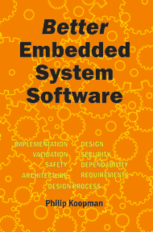
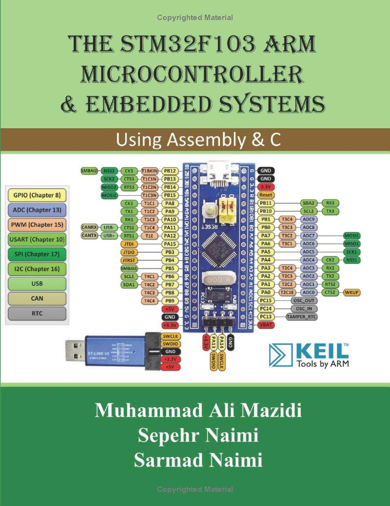
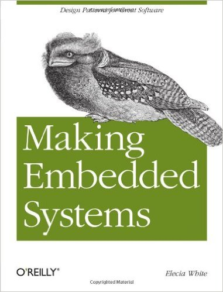
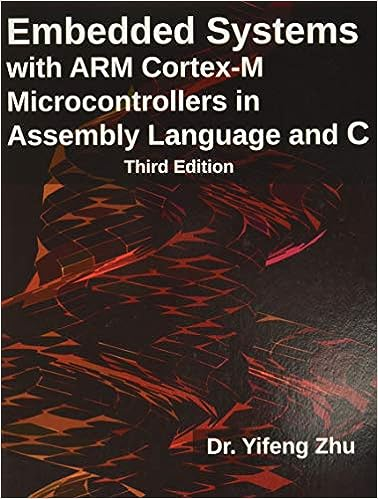
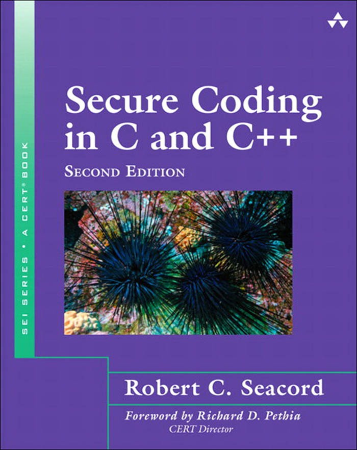

# ENSE 452 — Course Outline  
_Fall 2025_

**Embedded and Real-Time Software Systems**  
Trevor Douglas
University of Regina
Faculty of Engineering and Applied Science

---

## Instructor Information

- **Instructor**: Trevor Douglas  
- **Office**: ED473  
- **Phone**: 306.585.5269  
- **Email**: trevor.douglas@uregina.ca

---

## Lab Instructor Information

- **Instructor**: Trevor Douglas  
- **Office**: ED473  
- **Phone**: 306.585.5269  
- **Email**: trevor.douglas@uregina.ca

---

## Class Schedule

- **Lectures**: ED621, Tue/Thu, 10:00–11:15  
- **Labs**: ED485.1, Wed 08:30–11:15  
- **Midterm**: ED621, Oct 31, 2024 (TBD)  
- **Final**: ED621, Dec 19, 2024 (09:00–12:00)

---

## Course Description

You have already completed a significant embedded project in earlier courses. This course takes embedded and real-time system development further by incorporating:
 
- more rigorous software engineering techniques.
- including the use of an RTOS.
- developing software that interacts in real time with hardware devices.

---

## Topics Overview

1. Intro + review materials.  
2. Version control Git and GitHub.  
3. Device I/O.  
4. Writing ISRs.
5. Better embedded software.
6. FreeRTOS.
     
---

## Course texts

|   |  |
|:--|:--|

- **Our primary text** is *Better Embedded System Software* by Philip Koopman. 
- **A useful refresher:** *The STM32F103 ARM Microcontroller and Embedded Systems: Using Assembly and C*, by Mazidi et al.

---

## Other resource texts

|   |  | 
|:--|:--|:--|

- **1** Making Embedded Systems 
- **2** Embedded Systems with ARM Cortex-M
- **3** Secure Coding in C and C++
  
---

## Additional Resources

- **Phil Koopman’s Blog**  
- **Embedded Artistry**  
- **Interrupt Blog**  
- **Embedded.fm Podcast**

_Highly recommended for real-world insights._

---

## Preliminaries

- Git and GitHub will be used.  An optional tutorial will be the first lab.
- AWS VM (Linux Ubuntu) will be used for programming assignments.
- Course Project
- Labs - A Lab schedule will be on URCourses.  There are approximately 6 labs building towards the project.
- Assignments - Approximately 5 assignments.
- Knowledge from the Labs and Assignments are important for the midterm and final.

  <!-- Creating a VM will allow you to have a development system.  This will be optional. -->

---

## Student Submissions

- The course will be organized inside GitHub Classroom.
- This means all assignments, labs, and course project will be submitted through our classroom.
- Each time I ask for submission you will be provided a link that will create a private repository inside our classroom owned by you.
- As you progress through your work you will commit your changes and ultimately push to your GitHub remote.
- You will be graded on the work pushed to your repository so make sure you do this!

---

## Lecture style

The plan: Lectures and Labs will be in-class.

- I will sometimes just write on the board, so you should bring  
  a pencil and notebook (or equivalent technology) to the lecture.  
  - In these cases no content will be posted online.

- Sometimes I'll present information using slides, supplemented  
  with writing on the board.  
  - In these cases the slides will be posted after the lecture,  
    but not the board notes, so you should still make your own notes.

- For some course content I will post videos that can be watched  
  at your convenience.

---

## Lab Project 

We want it to include:

- Version Control (GitHub etc.)
- Nucleo Board
- at least two asynchronous device inputs  
- at least two device outputs  
- a CLI with serial communications  
- RTOS elements such as task communication
- an interesting, non-trivial algorithm  

---

## Lab Project

In previous offerings we've had:

- an air-flow based ball height control system  
- an inverted pendulum controller  
- a traffic intersection controller  
- an elevator controller  

---

## Evaluation Breakdown

- **Assignments**: 5% (~7)  
- **Labs & Project**: 25% (~9)  
- **Midterm**: 25%  
- **Final Exam**: 40%  
- **Quizzes**: 5%  
- _±5% Instructor’s Discretion_

---

## Grading Notes

- You **must pass both**:  
  - Combined **midterm + final** ≥ 50%  
  - **Labs/project** ≥ 50%

- Grades based on **demonstrated ability**, not just submissions.
- You may be asked to **explain or demo** your work in person.

---

## Policies

### Submitted Work

- Individual effort required  
- No sharing of code or detailed solutions
- STM32CubeIDE code generation is allowed.
- Use of ChatGPT is allowed but must be docemented when used.

### Late Submissions

- Late = **0%**  
- Due at the designated time only

---

## Special Needs + Conduct

- Contact instructor and Disability Resource Office early  
- **Academic misconduct** rules strictly enforced  
  [Read the student code of conduct](https://www.uregina.ca/student/registrar/resources-for-students/academic-calendars-and-schedule/undergraduate-calendar/assets/pdf/2024-25/student-code-of-conduct-and-right-to-appeal.pdf)
- [Be aware of counselling and student health services](https://www.uregina.ca/student-mental-health/index.html)
  
---

## Questions?

Thanks, and welcome to **ENSE /ENEL 452**!
