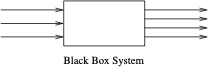
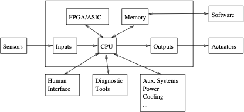

## Intro to Embedded and Real-Time Systems

Why is taking an embedded real-time development course a desirable thing?

- You develop a skillset that straddles hardware and software — this can make you an extremely valuable employee.
- Embedded development is hard, and the skills it exercises can make you a more effective programmer in general.
- There are many billions of deployed microprocessor-based embedded systems.  
  Many of these have at least one real-time deadline.  
  You might just end up working in this area, but even if not, the *mindset* is justified and appropriate.

---

## Why Take This Course?

- Designing small embedded projects is fun!
- It's *really* inexpensive to get into — there are tons of cheap micros, free development environments, and a large amount of online information.
- Having a deep understanding from taking a class can give you an **order of magnitude boost**.

---

## What will we learn?

- Good software design
- Control of real-world things  
- Real Time Operating System
- Good use of Revision Control  
- Better developer skills
- Other skills to help with the 4th year project

---

## What will we do? (cont)

- Labs are focused on a project  
  - Lots of engineering involved  
  - Minimal hardware  
  - Will use [FreeRTOS](https://www.freertos.org) (widely used in industry)

- Assignments  
  - More general, not all focused on the project  
  - We'll try to touch on fundamental skills, or tool use

---

## Quick, but useful definitions:

- **Embedded system**:  
  A purpose-built system that interacts with the real world and includes a computer as a component.

- **Real-time system**:  
  A (generally embedded) system that must explicitly satisfy timeliness constraints or suffer serious consequences (i.e. failure).  
  *Example:* On a fly-by-wire aircraft, when the control stick is moved, the control surfaces must respond within a bounded time.

<!-- _note:
Various applications need different requirements.  Relate Nortel phone development vs Opuswave needing RAM to execute code from.-->
---

## Other notable features of embedded systems

- They tend to be *single-purpose* systems, specialized for a given application.

- They tend to be resource-constrained in several ways:  
  memory, processing capability, word-size, physical size, power, weight,  
  time-to-market, cost, ...

- They are inconspicuously running *the world*.

---

## Other notable features of embedded systems

- They often use very complex processing algorithms

- They may include sophisticated *user interfaces*

- They often have *real-time* deadlines  
  - Hard real-time  
  - Soft real-time
  
<!-- _note: 
Old systems (e.g. SCSI) required sustained data rates from the host. Hard real-time
Modern interfaces (e.g. SAS, Fibre Channel) + buffering can absorb delays. Soft real-time
-->

---

## Other notable features of embedded systems

- They usually deal with periodic things, but they frequently  
  must deal with phenomena that are *multirate* (multiple periods), or even *sporadic*.

- They must often continue to run despite the occurrence of one or more HW or SW faults.

- They are often in control of safety-critical systems.

- They often have to run for decades without failing, sometimes with minimal or no maintenance.

- They may need to operate in harsh environments.

- They may have unique security requirements.

<!-- _note:
One place I worked at was tape storage backup designed by HW Engineers.  Entirely state machine and if they got into an unknown state it bricke... bad design -->

---

## Five broad categories of embedded systems

- Those that interact primarily with humans and not the physical world  
  *(e.g., games, ATMs, mobile phones)*

- Control systems  
  *(e.g., automotive, robotics, flight control)*

- Signal processing  
  *(e.g., music, video, radar, sonar)*

- Networking and communications  
  *(e.g., mobile phones, network switches, routers)*

- Monitoring and logging

---

## In engineering one can usefully model most anything as a

- **system**.  A succinct definition: A system is a mapping of a
  set of inputs into a set of outputs.

- Any computing system can be usefully modelled this way.

  

  ---

---

## The computing system has a set of one or more inputs entering a  
black box (which performs the system function), and a set of one or  
more outputs exiting the black box.

- Most frequently, the system receives its inputs from  
  *sensors* and *input devices* and delivers its outputs  
  to *actuators* and *displays*.

---

## Typical architecture of microcontroller

---

## The presence of the FPGA/ASIC implies the possibility of custom  
hardware (either in the field or at fabrication time), which in turn  
means there is another engineering tradeoff.

- do everything in software?  
- more flexible, can change by changing firmware
- do everything in custom hardware?  
- lower power, lower cost (but probably higher NRE cost), better performance

<!-- _note:
one place I work had software integrated with custom asics.
One of the HW design engineers explained it to me like in a plumbing situation.  The software adjusts the valves and pipes and the h/w is the water flowing through -->
---

## It turns out that the hardware/software partitioning of an embedded  
system is a tricky business.

- *hardware/software codesign*

In our case in this class: we have a fixed hardware platform with no  
FPGA. Our focus is *mostly* on software.