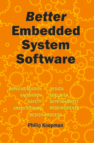
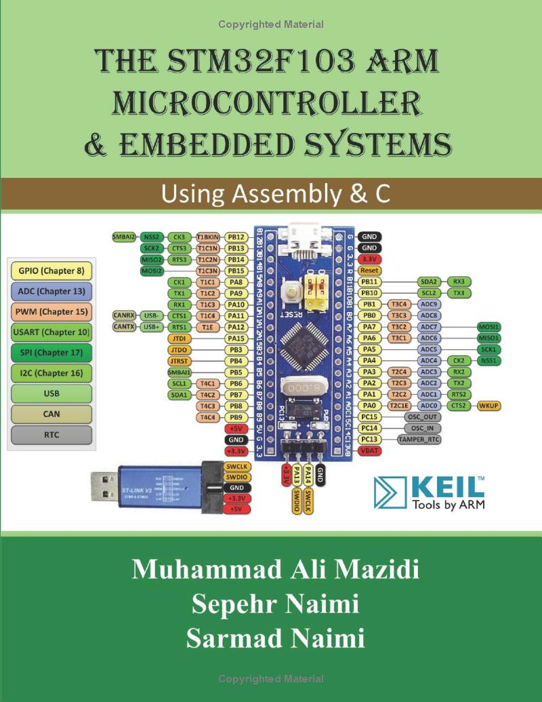
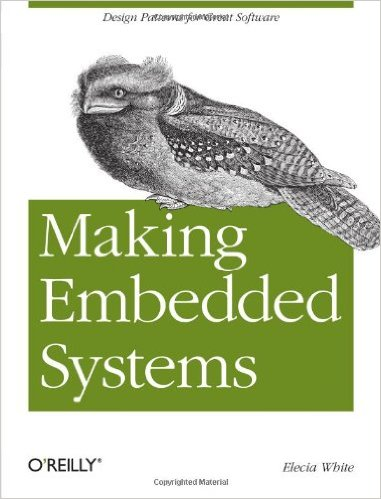
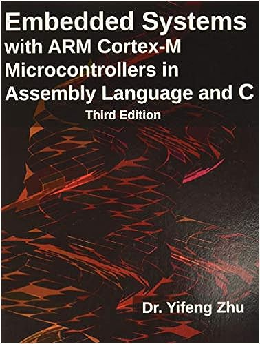
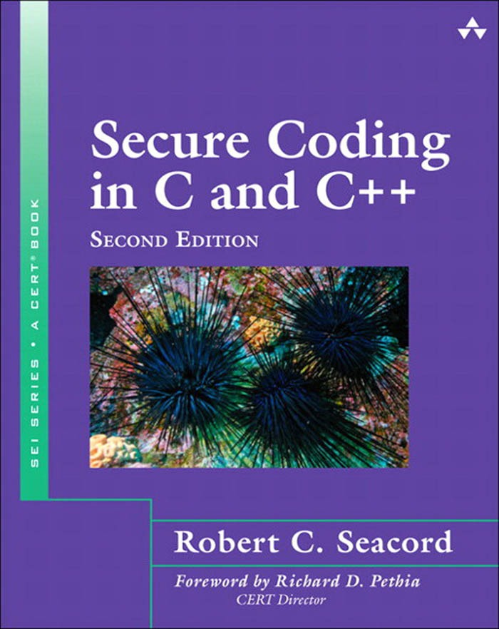

## Preliminaries

- Git and GitHub will be used.  An optional tutorial will be the first lab.
- AWS VM (Linux Ubuntu) will be used for programming assignments.
- Course Project
- Labs - A Lab schedule will be on URCourses.  There are approximately 6 labs building towards the project.
- Assignments - Approximately 5 assignments.
- Knowledge from the Labs and Assignments are important for the midterm and final.
  
---

## Lecture style

The plan: Lectures and Labs will be in-class.

- I will sometimes just write on the board, so you should bring  
  a pencil and notebook (or equivalent technology) to the lecture.  
  - In these cases no content will be posted online.

- Sometimes I'll present information using slides, supplemented  
  with writing on the board.  
  - In these cases the slides will be posted after the lecture,  
    but not the board notes, so you should still make your own notes.

- For some course content I will post videos that can be watched  
  at your convenience.

---

## Course texts

|   |  |
|:--|:--|

- **Our primary text** is *Better Embedded System Software* by Philip Koopman. 
- **A useful refresher:** *The STM32F103 ARM Microcontroller and Embedded Systems: Using Assembly and C*, by Mazidi et al.

---

## Other resource texts

|   |  | 
|:--|:--|:--|

- **1** Making Embedded Systems 
- **2** Embedded Systems with ARM Cortex-M
- **3** Secure Coding in C and C++
  
---

## Lab Project 

We want it to include:

- Version Control (GitHub etc.)
- Nucleo Board
- at least two asynchronous device inputs  
- at least two device outputs  
- a CLI with serial communications  
- RTOS elements such as task communication
- an interesting, non-trivial algorithm  

---

## Lab Project

In previous offerings we've had:

- an air-flow based ball height control system  
- an inverted pendulum controller  
- a traffic intersection controller  
- an elevator controller  

---
