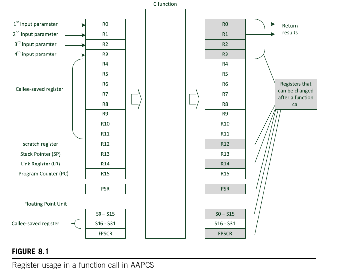

## ISR's

### C/Assembly Interface

To successfully call an assembly language function from C, or vice versa, requires understanding the Arm Architecture Procedure Call Standard (AAPCS).  <br>

See the file 

I will cover the bare essentials of the AAPCS below. For deeper understanding, the next slide is the recommended reading list from AAPCS (note: some good, some irrelevant):

<!-- _note
A good reason to look at calling assembly routines in C before covering ISRs is:

Understanding the C/Assembly interface provides essential foundations for how functions are invoked and how data is passed between high-level code and low-level routines.

This knowledge is crucial because:
	•	ISRs are assembly-level functions at their core, even when written in C—they follow strict calling conventions and stack handling rules defined by the AAPCS.
	•	Before you can understand how interrupts save state, pass parameters, or return, you must understand how any function call works at the assembly level.
	•	Debugging or optimizing ISRs often requires direct manipulation of registers and the stack, which relies on the conventions used for normal C/assembly interoperability.

So, by learning how to call assembly routines from C, students are better equipped to:
	•	Understand how registers are preserved,
	•	Recognize how parameter passing works,
	•	Prepare for the more complex, asynchronous nature of ISRs.
-->

---
## Arm Architecture Procedure Call Standard

> 📘 **Recommended Sections**  
> 1.2, 1.3, 2, 3, 4.1 (skip 4.1.1, 4.1.2),  
> 4.2, 4.3.x (skip 4.3.5),  
> 5.1, 5.1.1 (some names don’t apply to Cortex-M3),  
> 5.1.1.1, skip 5.1.2,  
> 5.2, 5.3 (skip 5.3.1.1), 5.4,  
> skip 5.5, 5.6,  
> skip all of 6,  
> read all of 7 except 7.1.7.x (bitfields)

---

The AAPCS defines a contract between the **caller** and **callee**, such as which registers each is responsible for saving.

- Caller: the function that *calls* another function.
- Callee: The function that *gets* called.
- Registers **not required to be preserved**:  
  `r0`, `r1`, `r2`, `r3`, `r12`  
  → These are **caller-saved**. Caller must preserve if needed.

- Registers **automatically saved/restored by callee**:  
  `r4` through `r11`  
  → These are **callee-saved**.

<!-- _note


-->
---

## C/Assembly Interface

Further AAPCS rules:

- For simple cases, **parameters** are passed in:
  - `r0` → parameter 1  
  - `r1` → parameter 2  
  - `r2` → parameter 3  
  - `r3` → parameter 4

- Return value (simple cases):  
  - Returned in `r0`

---

## C/Assembly Interface



---

## Example 

---

## Interrupt Handling

This discussion on interrupts is based on  
📘 *The Definitive Guide to ARM Cortex-M3 and Cortex-M4 Processors, 3rd Edition*, by **Joseph Yiu**.  
(The figure on the previous slide(s) is from that text.)

An **interrupt handler** (or *interrupt-service routine* — ISR) is a function that is called **asynchronously** in response to some external event.

---

## Interrupt Handling (continued)

To handle interrupts on our chip, we need to:

- Set up the stack (must be done in any case)
- Choose which exception number(s) to use
- Set up the vector table
- Set desired interrupt priorities  
  (⚠️ higher number = lower priority)
- Write the interrupt handlers (in assembly or C/C++)
- Place the handler addresses into the vector table
- Enable the interrupts

---

All embedded compilers provide ways to write **interrupt handlers in C/C++**.  
The design of the **ARM Cortex-M3** makes this one of the *easiest* MCUs to work with.

---

### Writing Handlers in Assembly

- The handler must **explicitly save and restore any registers** it modifies.
  - **Except** registers that are already saved/restored by the **interrupt hardware**.

Example:  
- On many MCUs (like x86), the hardware auto-saves:
  - **Program Counter (PC)**
  - **Flags**

---

## Interrupt Handling (continued)

In a regular function call, the **AAPCS** defines which registers are **caller-saved** and **callee-saved**, as described earlier.  
However, for an **Interrupt Service Routine (ISR)**, there's really *no caller*.

---

### Why?

- Interrupts occur **not** because they were called in the code...
- ...but because an **external event** happened.
  - ⚠️ An interrupt can happen **literally at any time**  
    (except when interrupts are disabled)

---

### Key Consequence

➡️ **All registers must be preserved by the ISR**  
(either by the **ISR itself** or the **hardware**)

---

## Interrupt Handling (continued)

Think about what would happen if an ISR **did not** preserve some register.

Here's the mainline code, incrementing `counter`:

```c
// C code
  counter++;
// Assembler output
1:  ldr r5,[r6]
2:  add r5, r5, #1
3:  str r5,[r6]
```
---

## Interrupt Handling (continued)

Now imagine an **interrupt occurs between line 1 and 2**, and the ISR changes `r5` to some other value...

👉 What happens?

➡️ The result stored back into memory will be **incorrect!**

---

## Interrupt Handling (continued)

So, an ISR **must not** leave any modified registers behind.

But does it need to save **all** registers?

🟡 It's a little tricky...

---

## Interrupt Handling (continued)

So, an ISR must preserve registers — but **only those it modifies**.

✅ This is a good thing — because saving registers is **expensive**.

- Memory access is slow compared to register operations
- Saving/restoring **all** registers on every interrupt would hurt performance

---

## Interrupt Handling (continued)

🔙 Historically, all ISRs were written in **assembly**.

- So you could (in theory) see exactly which registers were modified
- 😬 In practice, it's **hard** to track all modified registers in a non-trivial ISR

---

## Interrupt Handling (continued)

Now, ISRs are just functions, written in **C/C++**.

- So how do we know **which registers are damaged**?
- 🛟 **The AAPCS to the rescue!**
- The *callee-saved* registers won't be damaged (`r4`–`r11`)
  - Because the ISR is just a C function, and the compiler guarantees *every* C function preserves those registers

- The *caller-saved* registers will potentially be damaged (`r0`–`r3`, `r12`)

<!-- _note:
The callee-saved registers won’t be damaged (r4–r11)

These are registers that any function must preserve if it wants to use them:
	•	So if the ISR touches r4–r11, the compiler makes sure they are saved/restored.
	•	This means the main code doesn’t have to worry about these being overwritten.

✅ This is guaranteed by the compiler. You don’t have to do anything.

The caller-saved registers might be damaged (r0–r3, r12)

These are registers that a function can freely use without saving them:
	•	In regular function calls, the caller must save them if it needs their values preserved.
	•	But in an ISR, there’s no caller — it just interrupts.

So:
	•	If the ISR uses these registers (r0–r3, r12), and the hardware or compiler doesn’t automatically save them, then they could be overwritten — unless saved manually.

    On ARM Cortex-M (like M3, M4, M7):

You do NOT need to manually save caller-saved registers (r0–r3, r12, lr, pc, xPSR) in your ISR — the hardware already does it for you.
-->
---
## Interrupt handling, cont.

So the ISR must merely save `r0`–`r3`, and `r12`. Is that sufficient?

**No.**

Why?

---

## Interrupt handling, cont.

Because an ISR must preserve the *entire state* of the executing code.

Any changes *the ISR makes* must be reversed before the ISR exits.

- An exception to this rule is any change that is *supposed* to escape to communicate to the outside world.
  These kinds of changes are always there, but have to be *carefully controlled*. For instance, the ISR may:
  - Turn on a LED
  - Set a flag

---

## Interrupt handling, cont.

So we must also save some other stuff:

- The flags register (`PSR`)
- The program counter (`PC`)
- The link register (`LR`)

---

## Interrupt handling, cont.

Fun fact: In the event of an interrupt, the Cortex-M3 hardware automatically pushes the following registers, 
so that they are sorted (by decreasing address) in the given order[^1]:

- The PSR register
- The PC
- The LR
- `r12`
- `r3`, `r2`, `r1`, `r0`

Then jumps to the interrupt handler (address specified in the vector table).

[^1]: The actual time-ordering of the stack pushes is quite different from this, but the end result is the same.

---

## Interrupt handling, cont.

If the ISR is written in a high-level language like C/C++, etc., then it will obey the rules of the AAPCS.

- So it is going to save `r4`–`r11` (only if necessary)
- So that's everything:
  - In most cases, this amount of state is all you need to save, and it's basically handled by:
    1. The interrupt hardware
    2. The compiler vendor who obeys AAPCS

---